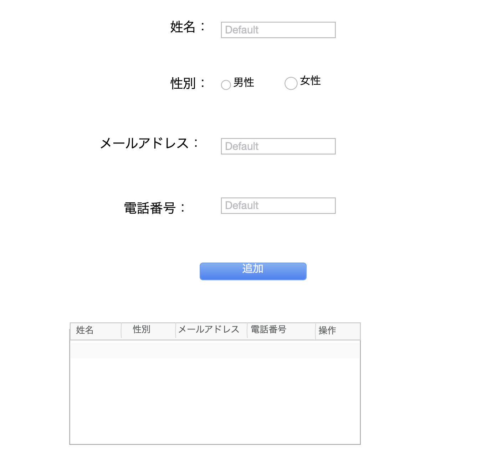
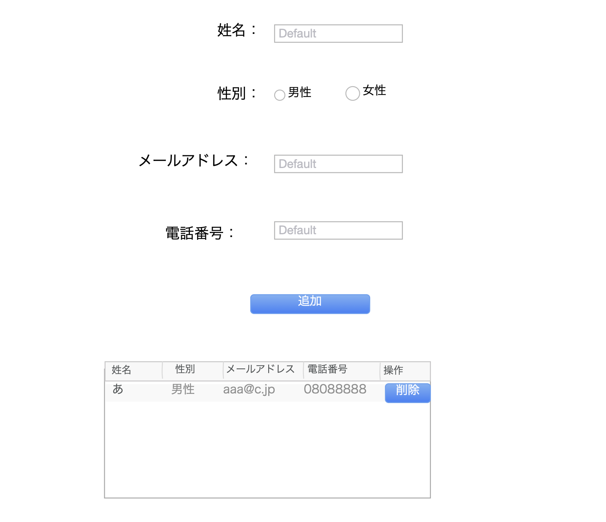

## HTML&jQuery試験

一つ画面を作る,最初画面は以下内容であること。

* 姓名入力框
* 性別入力框
* メールアドレス入力框
* 電話番号入力框
* 追加ボタン
* データなしのテーブル

### 1
入力框に内容を入力する、追加ボタンを押す、テーブルの中で入力のデータを追加します、他の入力框の内容をクリアします。

### 2
テーブルの削除ボタンを押す、このデータを削除します。
